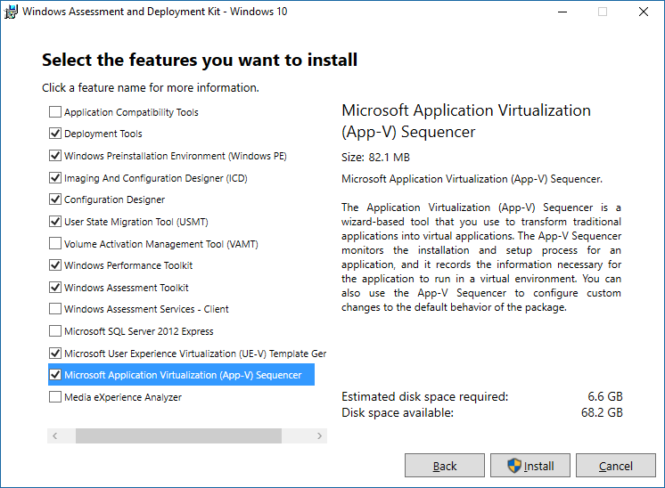

# Install the App-V Sequencer

**Applies to**:

- Windows 10
- Windows 11

Use the App-V Sequencer to convert Win32 applications into virtual packages for deployment to user devices. Those devices must be running the App-V client to allow users to interact with virtual applications.

The App-V Sequencer is included in the Windows client Assessment and Deployment Kit (Windows ADK).

>[!NOTE]
>The computer that will run the sequencer must not have the App-V client enabled. As a best practice, choose a computer with the same hardware and software configurations as the computers that will run the virtual applications. The sequencing process is resource-intensive, so make sure the computer that will run the Sequencer has plenty of memory, a fast processor, and a fast hard drive.

## How to install the App-V Sequencer

1. Go to [Download the Windows ADK](https://developer.microsoft.com/windows/hardware/windows-assessment-deployment-kit).
2. Select the **Get Windows ADK for Windows 10** button on the page to start the ADK installer. Make sure that **Microsoft Application Virtualization (App-V) Sequencer** is selected during the installation.

    
3. To open the Sequencer, go to the **Start** menu and select **Microsoft Application Virtualization (App-V) Sequencer**.

See [Creating and managing virtual applications](appv-creating-and-managing-virtualized-applications.md) and the [Application Virtualization Sequencing Guide](https://download.microsoft.com/download/F/7/8/F784A197-73BE-48FF-83DA-4102C05A6D44/App-V%205.0%20Sequencing%20Guide.docx) for information about creating virtual applications with the Sequencer.

## Command-line options for installing the sequencer

You can also use the command line to install the App-V sequencer. The following list displays information about options for installing the sequencer using the command line and **appv\_sequencer\_setup.exe**:

| Command       | Description  |
|-------------------|------------------|
| **/INSTALLDIR**       | Specifies the installation directory.  |
| **/Log**   | Specifies where the installation log will be saved. The default location is **%Temp%**. For example, **C:\\Logs\\log.log**.    |
| **/q**     | Specifies a quiet or silent installation.      |
| **/Uninstall**        | Specifies the removal of the sequencer.  |
| **/ACCEPTEULA**       | Accepts the license agreement. This is required for an unattended installation. For example, **/ACCEPTEULA** or **/ACCEPTEULA=1**.         |
| **/LAYOUT**           | Specifies the associated layout action. It also extracts the Windows Installer (.msi) and script files to a folder without installing App-V. No value is expected. |
| **/LAYOUTDIR**        | Specifies the layout directory. Requires a string value. For example, **/LAYOUTDIR=”C:\\Application Virtualization Client”**.    |
| **/?** or **/h** or **/help** | Displays associated help.   |

## To troubleshoot the App-V sequencer installation

For more information regarding the sequencer installation, you can view the error log in the **%temp%** folder. To review the log files, click **Start**, type **%temp%**, and then look for the **appv\_ log**.

## Related topics

* [Planning to deploy App-V](appv-planning-to-deploy-appv.md)
