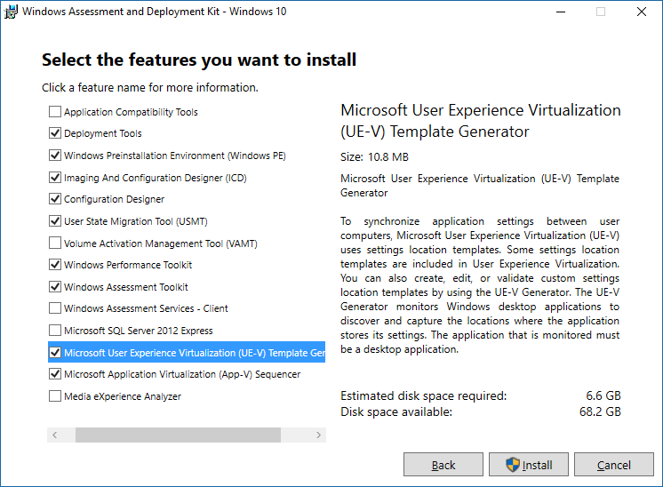

# Upgrade to UE-V for Windows 10

**Applies to**
-   Windows 10, version 1607

If you’re already using UE-V 2.x and you’re planning to upgrade user devices to Windows 10, version 1607 or later releases, you need to make only a few adjustments to your existing environment. These steps are explained in more detail below.

1. Upgrade user devices to Windows 10, version 1607 or later release. 

2. Verify that UE-V settings were migrated correctly.

3.  Set the template storage path to your current template store.

4. Enable the UE-V service on user devices.

5. Install the UE-V template generator if you want to synchronize application settings for custom applications.

> [!IMPORTANT]
> You can upgrade your existing UE-V installation to Windows 10, version 1607 from UE-V versions 2.1 or 2.0 only. If you are using a previous version of UE-V, you’ll need to upgrade from that version to UE-V 2.x before you upgrade to Windows 10, version 1607.

## Upgrade user devices to Windows 10, version 1607

Performing an in-place upgrade on user devices automatically installs the UE-V service, updates the settings location path, and migrates users' UE-V settings. See the [Windows 10 documentation for IT Pros](https://technet.microsoft.com/itpro/windows/deploy/index) for information about upgrading user devices to Windows 10. 

## Verify that UE-V settings were migrated correctly 

After upgrading a user device to Windows 10, version 1607, it’s important to verify that UE-V settings and template registrations were migrated correctly during the upgrade. You can verify UE-V settings using Windows PowerShell or the device’s registry.

**To verify UE-V settings using Windows PowerShell**

1. Run PowerShell as Administrator, type **Get-UEVConfiguration**, and press ENTER to view current configurations.

2. Check that the settings were successfully updated.

3. Type **Get-UEVTemplate** and press ENTER to check that your templates are still registered.

    > [!NOTE]
    > You’ll need to register the NotePad template again after you upgrade the device to Windows 10. 

**To verify UE-V settings using the device’s registry**

1. In a command prompt, run **Regedit** as Administrator.

2. Navigate to **HKEY_LOCAL_MACHINE\Software\Microsoft\UEV\Agent\Configuration.**

3. Verify that the settings storage path and the settings template catalog path are pointing to the same locations as before you upgraded the device to Windows 10.

## Set the template storage path to your current template store

Template Settings Storage Path will not automatically migrate. Run Set-UEVConfiguration in PowerShell or use the settings storage path Group Policy to configure and point to your current settings storage folder.

## Enable the UE-V service on user devices

The UE-V service is the client-side component that captures user-personalized application and Windows settings and saves them in settings packages. Settings packages are built, locally stored, and copied to the settings storage location. 

With Windows 10, version 1607 and later, the UE-V service replaces the UE-V Agent and no longer requires a separate download and installation. Enable the service on user devices to start using UE-V. You can enable the service with the Group Policy editor or with Windows PowerShell. 

> [!IMPORTANT]
> The UE-V Agent used in prior releases of UE-V is replaced with the UE service. The UE-V service included with Windows 10, version 1607 and later releases, does not include the agent user interface and is configurable through cmdlets or registry settings only.

**To enable the UE-V service with Group Policy**

1. Open the device’s **Group Policy Editor**.

2. Navigate to **Computer Configuration > Administrative Templates > Windows Components > Microsoft User Experience Virtualization**. 

3. Run **Enable UEV**

4. Restart the device.

**To enable the UE-V service with Windows PowerShell**

1. Run PowerShell as Administrator, type **Enable-UEV**, and press ENTER.

2. Restart the device.

3. Type **Get-UEVStatus** and press ENTER to verify that the service was successfully enabled.

## Install the UE-V template generator

The UE-V template generator is included in the Windows Assessment and Deployment Kit (ADK) for Windows 10. 

**To install the UE-V template generator**

1. Go to [Download the Windows ADK](https://developer.microsoft.com/en-us/windows/hardware/windows-assessment-deployment-kit) to access the ADK. 

2. Select the **Get Windows ADK for Windows 10** button on this page to start the ADK installer. On the screen pictured below, select **Microsoft User Experience Virtualization (UE-V) Template Generator** and then select **Install**.

    
 
3. To open the generator, open the **Start** menu and navigate to **Windows Kits** > **Microsoft User Experience Virtualization (UE-V) Template Generator**. 

## Other resources for this feature

-   [UE-V Release Notes](uev-release-notes-1607.md)

-   [Prepare a UE-V Deployment](uev-prepare-for-deployment.md)

-   [Administer UE-V](uev-administering-uev.md)

-   [Migrating settings packages](uev-migrating-settings-packages.md)

-   [Technical Reference for UE-V](uev-technical-reference.md)
